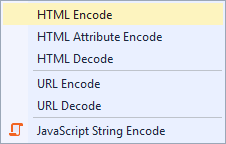

# Editor Enhancements

Download this extension from the [VS Gallery](https://visualstudiogallery.msdn.microsoft.com/4f64e542-3772-4136-8f87-0113441c7aa1)
or get the [CI build](http://vsixgallery.com/extension/a3112f81-e423-4f88-9f2c-e089a309e48e/).

---------------------------------------

Provides additional features such as HTML and URL encodings,
transformations and sorting of selected text the editor.

## Features

- String encodings/decoding
- String transformation
- Hashing
- Remove duplicate lines
- Line sorting

## Edit menu
The features are located in 3 menus under the top level 
**Edit** menu.

You can also find them in the context-menu inside the editor.

### Encoding
This is a collection of various encodings and decodings
primarily used in HTML and XML documents and strings.

### Transform
Some simple commands to transform the selected strings.

It even has some popular hashing algorithms handy.

### Lines
This gives you easy access to sort the selected lines
alphabetically, as well as removing empty- and duplicate
lines.

## Contribute
Check out the [contribution guidelines](.github/CONTRIBUTING.md)
if you want to contribute to this project.

For cloning and building this project yourself, make sure
to install the
[Extensibility Tools 2015](https://visualstudiogallery.msdn.microsoft.com/ab39a092-1343-46e2-b0f1-6a3f91155aa6)
extension for Visual Studio which enables some features
used by this project.

## License
[Apache 2.0](LICENSE)